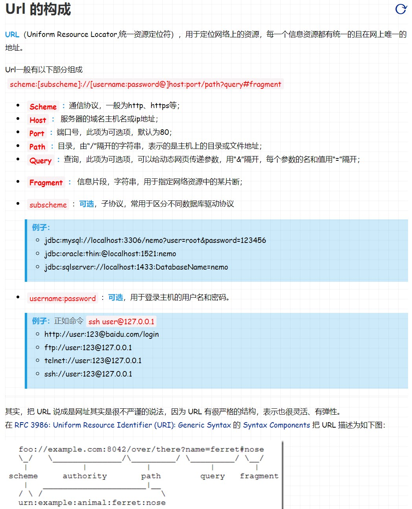

# Stanford CS 142 Web Development

### URL and URI

我们从名字上看

统一资源标识符(Uniform Resource Identifier, URI)：是一个用于标识某一互联网资源名称的字符串。
统一资源定位符(Uniform Resource Locator, URL)：是一个用于标识和定位某一互联网资源名称的字符串。

可能大家就比较困惑了，这俩好像是一样的啊？那我们就类比一下我们现实生活中的情况：
我们要找一个人——张三，我们可以通过他的唯一的标识来找，比如说身份证，那么这个身份证就唯一的标识了一个人，这个身份证就是一个 URI；
而要找到张三，我们不一定要用身份证去找，我们还可以根据地址去找，如 在清华大学18号宿舍楼的404房间第一个床铺的张三，我们也可以唯一确定一个张三，
`动物住址协议://地球/中国/北京市/清华大学/18号宿舍楼/404号寝/张三.人。而这个地址就是我们用于标识和定位的 URL。`
我们从上面可以很明显的看出，URI 通过任何方法标识一个人即可，而 URL 虽然也可以标识一个人，但是它主要是通过定位地址的方法标识一个人，所以 URL 其实是 URI 的一个子集，即 URL 是靠标识定位地址的一个 URI。

#### This Keyword

- 对于非Arrow Function, this指向调用当前方法的Object。如果这是一个non-method function，this指向global object。上面描述的是默认情况，当然我也可以通过bind，call等方法来改变this的reference。
- 对于Arrow Function，Arrow functions don't have their own “this”, and they don’t redefine the value of “this ”within the function. **Regardless of how you execute arrow functions, this inside an arrow function always refers to this from the outer context.** This means that this keyword is lexically bound in arrow functions. This始终为在创建该arrow function时指向的值。

#### Promise

.jpg)